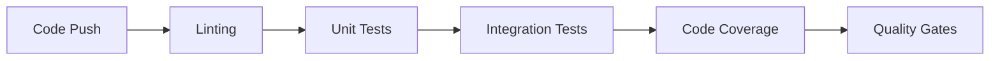
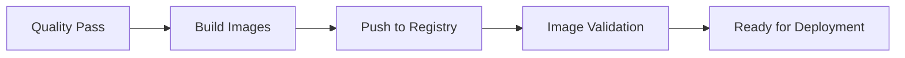

# 🚀 **COMPLETE CI/CD DEPLOYMENT STRATEGY**

## **Overview**

This document outlines the complete CI/CD pipeline for the Open Policy Platform, implementing **Blue-Green** deployments for QNAP/UAT and **Canary** deployments for Azure production.

---

## **🏗️ Architecture Overview**

```
┌─────────────────┐    ┌─────────────────┐    ┌─────────────────┐
│   LOCAL DEV     │    │   QNAP/UAT      │    │   AZURE PROD    │
│                 │    │                 │    │                 │
│ • Docker Compose│    │ • Blue-Green    │    │ • Canary        │
│ • Single Replica│    │ • 2 Replicas    │    │ • 5-10 Replicas │
│ • Minimal Res   │    │ • Mod Resources │    │ • Full Resources│
└─────────────────┘    └─────────────────┘    └─────────────────┘
         │                       │                       │
         ▼                       ▼                       ▼
┌─────────────────┐    ┌─────────────────┐    ┌─────────────────┐
│   GITHUB ACTIONS│    │   HELM CHARTS   │    │   KUBERNETES    │
│                 │    │                 │     │                 │
│ • Code Quality  │    │ • values-local  │    │ • AKS Cluster   │
│ • Unit Tests    │    │ • values-uat    │    │ • Load Balancer │
│ • Integration   │    │ • values-prod   │    │ • Auto-scaling  │
└─────────────────┘    └─────────────────┘    └─────────────────┘
```

---

## **🔄 Deployment Strategies**

### **1. Blue-Green Deployment (QNAP/UAT)**

**Purpose**: Zero-downtime deployments with instant rollback capability

**How it works**:
1. **Blue Environment**: Current live deployment serving all traffic
2. **Green Environment**: New version deployed alongside Blue (no traffic)
3. **Validation**: Test Green environment thoroughly in isolation
4. **Traffic Switch**: Redirect all traffic from Blue to Green
5. **Rollback**: If issues occur, instantly switch back to Blue
6. **Cleanup**: Remove Blue after Green is confirmed stable

**Benefits**:
- ✅ **Zero Downtime**: No service interruption during deployment
- ✅ **Instant Rollback**: Traffic can be switched back in seconds
- ✅ **Full Testing**: New version tested before exposing users
- ✅ **Risk Mitigation**: Issues contained to new environment only

**Implementation**:
```bash
# Deploy Blue environment
helm upgrade --install openpolicy-blue ./charts/open-policy-platform \
  -f values-uat.yaml \
  --set deployment.blueGreen.color=blue \
  --namespace uat

# Deploy Green environment
helm upgrade --install openpolicy-green ./charts/open-policy-platform \
  -f values-uat.yaml \
  --set deployment.blueGreen.color=green \
  --namespace uat

# Switch traffic to Green
kubectl patch svc openpolicy-api-gateway -n uat \
  -p '{"spec":{"selector":{"color":"green"}}}'
```

---

### **2. Canary Deployment (Azure Production)**

**Purpose**: Gradual rollout with real-time monitoring and controlled risk

**How it works**:
1. **Stable Environment**: Current production deployment (100% traffic)
2. **Canary Environment**: New version deployed alongside Stable
3. **Progressive Traffic**: Gradually increase traffic to Canary (5% → 25% → 50% → 100%)
4. **Monitoring**: Real-time performance and error monitoring
5. **Auto-Promotion**: Automatically promote if metrics are good
6. **Auto-Rollback**: Automatically rollback if issues detected

**Benefits**:
- ✅ **Risk Control**: Issues affect only small percentage of users
- ✅ **Real-time Monitoring**: Performance metrics during rollout
- ✅ **Gradual Validation**: Confidence builds as traffic increases
- ✅ **Automated Safety**: Automatic rollback on failures

**Implementation**:
```bash
# Deploy Canary with 5% traffic
helm upgrade --install openpolicy-canary ./charts/open-policy-platform \
  -f values-prod.yaml \
  --set deployment.canary.enabled=true \
  --set deployment.canary.initialTraffic=5 \
  --namespace production

# Progressive traffic increase
./scripts/update-canary-traffic.sh 25  # 25% traffic
./scripts/update-canary-traffic.sh 50  # 50% traffic
./scripts/update-canary-traffic.sh 100 # 100% traffic

# Promote Canary to Stable
kubectl patch svc openpolicy-api-gateway -n production \
  -p '{"spec":{"selector":{"version":"canary"}}}'
```

---

## **🌍 Environment Configurations**

### **Local Development**
- **Purpose**: Developer testing and validation
- **Resources**: Minimal (single replicas, low memory/CPU)
- **Deployment**: Docker Compose
- **Monitoring**: Basic health checks
- **Security**: Relaxed for development

**Key Settings**:
```yaml
# values-local.yaml
microservices:
  apiGateway:
    replicaCount: 1
    resources:
      requests:
        memory: 64Mi
        cpu: 50m
      limits:
        memory: 256Mi
        cpu: 250m

monitoring:
  healthChecks:
    periodSeconds: 30  # Less aggressive
    failureThreshold: 3
```

---

### **QNAP/UAT Environment**
- **Purpose**: Pre-production testing and validation
- **Resources**: Moderate (2 replicas, balanced resources)
- **Deployment**: Kubernetes with Helm
- **Strategy**: Blue-Green deployment
- **Monitoring**: Production-like with alerts

**Key Settings**:
```yaml
# values-uat.yaml
microservices:
  apiGateway:
    replicaCount: 2
    resources:
      requests:
        memory: 256Mi
        cpu: 250m
      limits:
        memory: 1Gi
        cpu: 1000m

deployment:
  blueGreen:
    enabled: true
    autoSwitch: false
    switchAfter: 600  # 10 minutes
    rollbackOnFailure: true

hpa:
  enabled: true
  minReplicas: 2
  maxReplicas: 5
```

---

### **Azure Production**
- **Purpose**: Live production environment
- **Resources**: Full (5-10 replicas, high resources)
- **Deployment**: Kubernetes with Helm
- **Strategy**: Canary deployment
- **Monitoring**: Aggressive with auto-scaling

**Key Settings**:
```yaml
# values-prod.yaml
microservices:
  apiGateway:
    replicaCount: 5
    resources:
      requests:
        memory: 512Mi
        cpu: 500m
      limits:
        memory: 2Gi
        cpu: 2000m

deployment:
  canary:
    enabled: true
    initialTraffic: 5
    stepSize: 5
    stepInterval: 30
    autoPromote: true
    rollbackOnFailure: true

hpa:
  enabled: true
  minReplicas: 3
  maxReplicas: 20
  targetCPUUtilizationPercentage: 70
```

---

## **🚀 CI/CD Pipeline Flow**

### **Phase 1: Code Quality & Testing**


**Jobs**:
- **Code Quality**: Python, Go, Node.js linting
- **Unit Testing**: All services with coverage reports
- **Integration Testing**: Service-to-service communication
- **Quality Gates**: Must pass all checks to proceed

---

### **Phase 2: Image Building & Registry**


**Jobs**:
- **Parallel Building**: All 23 services built simultaneously
- **Registry Push**: GitHub Container Registry (ghcr.io)
- **Image Validation**: Security scanning and size optimization
- **Cache Optimization**: Layer caching for faster builds

---

### **Phase 3: Environment Deployment**

#### **Local Environment**
```bash
# Automated local testing
docker-compose -f docker-compose.complete.yml up -d
./scripts/wait-for-services.sh
./scripts/run-integration-tests.sh
./scripts/test-scrapers.sh
./validate-scraper-schemas.sh
```

#### **QNAP/UAT Environment**
```bash
# Blue-Green deployment
helm upgrade --install openpolicy-blue ./charts/open-policy-platform \
  -f values-uat.yaml --set deployment.blueGreen.color=blue

helm upgrade --install openpolicy-green ./charts/open-policy-platform \
  -f values-uat.yaml --set deployment.blueGreen.color=green

# Traffic switch
kubectl patch svc openpolicy-api-gateway -n uat \
  -p '{"spec":{"selector":{"color":"green"}}}'
```

#### **Azure Production**
```bash
# Canary deployment
helm upgrade --install openpolicy-canary ./charts/open-policy-platform \
  -f values-prod.yaml --set deployment.canary.enabled=true

# Progressive traffic increase
./scripts/update-canary-traffic.sh 25
./scripts/update-canary-traffic.sh 50
./scripts/update-canary-traffic.sh 100

# Promotion
kubectl patch svc openpolicy-api-gateway -n production \
  -p '{"spec":{"selector":{"version":"canary"}}}'
```

---

## **🔍 Monitoring & Observability**

### **Health Checks**
- **Liveness Probes**: Detect deadlocks and unresponsive services
- **Readiness Probes**: Ensure service can handle traffic
- **Startup Probes**: Handle slow-starting services

### **Metrics Collection**
- **Prometheus**: System and application metrics
- **Grafana**: Visualization and dashboards
- **Custom Metrics**: Business-specific KPIs

### **Logging & Tracing**
- **ELK Stack**: Centralized logging (Elasticsearch, Logstash, Kibana)
- **Fluentd**: Log aggregation from all containers
- **Jaeger**: Distributed tracing for microservices

### **Alerting**
- **Slack Integration**: Real-time notifications
- **Email Alerts**: Daily summaries and critical issues
- **Auto-Remediation**: Automatic rollback on failures

---

## **🛡️ Security & Compliance**

### **Secrets Management**
- **Local**: Environment variables and .env files
- **UAT**: Kubernetes Secrets
- **Production**: Azure Key Vault integration

### **Network Policies**
- **Ingress Rules**: Controlled external access
- **Egress Rules**: Limited outbound connections
- **Service Mesh**: Istio for advanced traffic management

### **Container Security**
- **Non-root Users**: All containers run as non-root
- **Read-only Filesystems**: Immutable container images
- **Capability Dropping**: Minimal container privileges

---

## **📊 Performance & Scaling**

### **Horizontal Pod Autoscaler (HPA)**
```yaml
hpa:
  enabled: true
  minReplicas: 3
  maxReplicas: 20
  targetCPUUtilizationPercentage: 70
  targetMemoryUtilizationPercentage: 70
```

### **Vertical Pod Autoscaler (VPA)**
```yaml
scaling:
  verticalPodAutoscaler:
    enabled: true
    updatePolicy:
      updateMode: "Auto"
```

### **Cluster Autoscaler**
```yaml
scaling:
  clusterAutoscaler:
    enabled: true
    scaleDownDelayAfterAdd: 10m
    maxNodeProvisionTime: 15m
```

---

## **🔄 Rollback Strategies**

### **Automatic Rollback Triggers**
- **Health Check Failures**: Multiple consecutive failures
- **Performance Degradation**: Response time > threshold
- **Error Rate Increase**: Error percentage > acceptable limit
- **Resource Exhaustion**: Memory/CPU usage > limits

### **Manual Rollback Commands**
```bash
# Rollback to previous version
helm rollback openpolicy-platform 1

# Switch traffic back (Blue-Green)
kubectl patch svc openpolicy-api-gateway -n uat \
  -p '{"spec":{"selector":{"color":"blue"}}}'

# Rollback Canary (Production)
kubectl rollout undo deployment/openpolicy-canary-api-gateway -n production
```

---

## **📈 Success Metrics**

### **Deployment Metrics**
- **Deployment Frequency**: Daily deployments to production
- **Lead Time**: Code commit to production deployment
- **Mean Time to Recovery (MTTR)**: < 5 minutes for rollbacks
- **Change Failure Rate**: < 5% of deployments

### **Performance Metrics**
- **Response Time**: API Gateway < 100ms
- **Throughput**: 1000+ requests/second
- **Availability**: 99.9% uptime
- **Error Rate**: < 0.1% of requests

### **Business Metrics**
- **Scraper Success Rate**: > 95% successful data collection
- **Data Quality Score**: > 90% accuracy
- **User Satisfaction**: > 4.5/5 rating

---

## **🚀 Getting Started**

### **1. Local Development**
```bash
# Clone repository
git clone https://github.com/your-org/open-policy-platform.git
cd open-policy-platform

# Start local environment
docker-compose -f docker-compose.complete.yml up -d

# Validate schemas
./validate-scraper-schemas.sh

# Run tests
./scripts/run-integration-tests.sh
```

### **2. UAT Deployment**
```bash
# Deploy to QNAP/UAT
helm upgrade --install openpolicy-platform ./charts/open-policy-platform \
  -f ./charts/open-policy-platform/values-uat.yaml \
  --namespace uat --create-namespace
```

### **3. Production Deployment**
```bash
# Deploy to Azure
helm upgrade --install openpolicy-platform ./charts/open-policy-platform \
  -f ./charts/open-policy-platform/values-prod.yaml \
  --namespace production --create-namespace
```

---

## **🔮 Future Enhancements**

### **Advanced Deployment Strategies**
- **A/B Testing**: User experience experimentation
- **Feature Flags**: Gradual feature rollouts
- **Dark Launches**: Hidden feature testing

### **Advanced Monitoring**
- **Machine Learning**: Anomaly detection
- **Predictive Scaling**: Proactive resource management
- **Self-healing**: Automatic issue resolution

### **DevOps Automation**
- **GitOps**: Declarative infrastructure management
- **Infrastructure as Code**: Terraform integration
- **Chaos Engineering**: Resilience testing

---

## **📚 Additional Resources**

- **Helm Documentation**: https://helm.sh/docs/
- **Kubernetes Best Practices**: https://kubernetes.io/docs/concepts/
- **GitHub Actions**: https://docs.github.com/en/actions
- **Azure AKS**: https://docs.microsoft.com/en-us/azure/aks/

---

## **🎯 Summary**

This CI/CD pipeline provides:

✅ **Zero-downtime deployments** with Blue-Green strategy  
✅ **Risk-controlled rollouts** with Canary deployments  
✅ **Automated testing** at every stage  
✅ **Comprehensive monitoring** and alerting  
✅ **Instant rollback** capabilities  
✅ **Multi-environment** support (Local, UAT, Production)  
✅ **Security-first** approach with compliance  
✅ **Performance optimization** with auto-scaling  

**Your Open Policy Platform is now ready for enterprise-grade deployments! 🚀**
